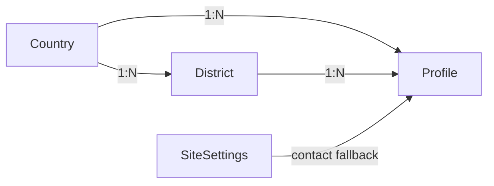
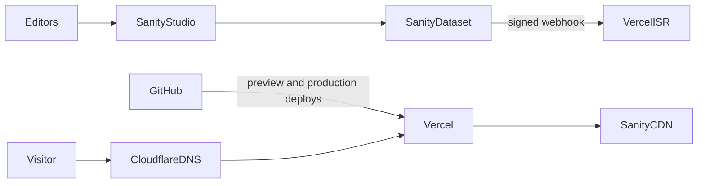

# Production-архитектура SEO-каталога

Статус: финальная редакция перед началом разработки.
Основание: `docs/PROJECT_RULES.md` и результаты архитектурного ревью.

Документ фиксирует решения, а не только рекомендации. Отклонение от него допускается после явного обсуждения; список сознательно отвергнутых вариантов приведён в конце.

## 1. Архитектурные принципы

- Один Next.js-проект: App Router, React Server Components, TypeScript strict, Tailwind CSS.
- Sanity — единственный источник управляемого контента. Отдельные backend, SQL/Redis, GraphQL и authentication system не нужны.
- Публичный контент формируется на сервере и доступен без JavaScript. Клиентский код нужен только для необязательной аналитики CTA.
- 50–100 профилей позволяют генерировать все индексируемые страницы статически и обновлять их через ISR.
- English — язык по умолчанию без префикса. Traditional Chinese — под префиксом `/zh-hk/`.
- Cloudflare используется как DNS, Vercel — как hosting, CDN и runtime. Cloudflare Proxy не включается без документированной причины и проверки совместимости с ISR.
- При выборе между простым и умным решением выбирается простое. Механизм, который не нужен на 100 профилях, не добавляется авансом.

## 2. Структура проекта

```text
src/
  app/
    layout.tsx
    page.tsx
    not-found.tsx
    robots.ts
    sitemap.ts
    [country]/
      page.tsx
      [district]/page.tsx
      profiles/[profile]/page.tsx
    zh-hk/
      layout.tsx
      page.tsx
      not-found.tsx
      [country]/
        page.tsx
        [district]/page.tsx
        profiles/[profile]/page.tsx
    api/
      revalidate/route.ts
  components/
    layout/
    catalog/
    contact/
    seo/
  i18n/
    config.ts
    dictionaries/
      en.ts
      zh-hk.ts
  lib/
    env.ts
    metadata.ts
    urls.ts
    visibility.ts
    analytics.ts
  sanity/
    client.ts
    queries.ts
    image.ts
    schemaTypes/
public/
  icons/
sanity.config.ts
next.config.ts
docs/
  PROJECT_RULES.md
  ARCHITECTURE.md
```

Слоёв ровно столько, сколько нужно: `app/` содержит реальные страницы вместе с их `generateMetadata` и `generateStaticParams`, общая разметка живёт в `components/`, доступ к данным — в `sanity/`, чистые утилиты — в `lib/`. Промежуточный слой page-компонентов не вводится: логика одной страницы не должна быть размазана по двум файлам.

Восемь route-файлов (две локали × четыре типа страниц) остаются тонкими и переиспользуют общие компоненты. `generateStaticParams` для всех восьми реализуется через общие хелперы в `sanity/queries.ts`, чтобы правки не расходились между локалями. Небольшое дублирование route-обёрток дешевле middleware, catch-all-парсера или i18n-библиотеки.

Sanity Studio разворачивается отдельно средствами Sanity и не публикуется на основном домене.

## 3. App Router и URL

Публичные канонические маршруты:

```text
/                                      English landing
/{country}/                            Country
/{country}/{district}/                 District
/{country}/profiles/{profile}/         Profile
/zh-hk/                                Traditional Chinese landing
/zh-hk/{country}/                      Country
/zh-hk/{country}/{district}/           District
/zh-hk/{country}/profiles/{profile}/   Profile
```

Примеры:

```text
/hong-kong/
/hong-kong/central/
/hong-kong/profiles/anna/
/zh-hk/hong-kong/
/zh-hk/hong-kong/central/
/zh-hk/hong-kong/profiles/anna/
```

Правила:

- `trailingSlash: true`. Все внутренние ссылки пишутся сразу со слешем, чтобы навигация не проходила через лишний редирект.
- Slug — ASCII, lowercase, дефисы, стабилен между локалями и immutable после первой публикации. Переводится отображаемое название, но не URL-сегмент.
- Профиль не вкладывается в district-путь: его canonical не меняется при переносе между районами. Район отражается в данных, breadcrumb и листингах.
- `profiles` — зарезервированный сегмент. Для country и district дополнительно запрещены `zh-hk`, `api`, `studio`, `_next`, `robots.txt`, `sitemap.xml`.
- Перед запросом в Sanity значение динамического сегмента проверяется регулярным выражением slug. Мусорный трафик на несуществующие пути отсекается до обращения к CMS.
- Переименование slug — редкая операция, оформляется записью в `redirects()` в `next.config.ts` и деплоем. Поле истории slug в CMS не заводится.
- HTTP→HTTPS и www→основной host нормализуются на уровне domain configuration Vercel.
- `redirects()` в Next.js по умолчанию сохраняет query-строку, поэтому UTM переживают редирект без дополнительного кода. Внутренние ссылки UTM никогда не добавляют.

Статический сегмент `zh-hk` имеет приоритет над `[country]`, поэтому обе языковые ветки сосуществуют без коллизий маршрутов.

## 4. Internationalization

- Поддерживаемые локали описаны типизированной конфигурацией в `i18n/config.ts`: `en` и `zh-Hant-HK`. URL-ключ второй локали — `zh-hk`.
- UI-строки лежат в TypeScript-словарях. Новая локаль добавляется через locale config, словарь, локализованные поля Sanity и тонкую route-ветку.
- Контент Sanity хранится в объектах локализации на одном документе: `title.en`, `title.zhHantHK`. Отдельных документов на локаль нет, поэтому ссылки и жизненный цикл не расходятся между языками.
- English обязателен. Китайская страница публикуется при наличии переведённых названия и основного текста. SEO title и description, а также alt изображений имеют fallback на основные поля и на полноту перевода не влияют: правка второстепенного поля не должна убирать проиндексированную страницу.
- Локаль, не прошедшая проверку полноты, возвращает 404 и не попадает ни в hreflang, ни в sitemap, ни в переключатель языка. Решение принимает единый предикат из раздела 6.
- Автоматических редиректов по `Accept-Language`, cookie или геолокации нет: и пользователь, и поисковик получают стабильный URL. Переключатель языка ведёт на точный эквивалент страницы и скрывается, если эквивалент не опубликован.
- Каждая локаль имеет собственную страницу 404 (`app/not-found.tsx` и `app/zh-hk/not-found.tsx`).
- Middleware для i18n не используется.

## 5. Sanity content model

Общие поля всех публичных типов: `internalName` для Studio, immutable `slug`, `status`, `sortOrder`, локализованные текстовые поля.

### `siteSettings` singleton

- Название, юридически корректное описание агентства и логотип (используется только в JSON-LD `Organization`, не рендерится на странице напрямую).
- Default SEO title, description и social image.
- Global Telegram (manager), WhatsApp и опциональный Telegram channel.
- Контактные значения служат fallback для профилей.
- Production base URL здесь **не хранится**: он берётся из environment variable, чтобы правка в CMS не могла одномоментно переписать canonical всего сайта.
- В Studio поля сгруппированы в три вкладки — Brand / Contact / Social — вместо одной длинной формы.

### `country`

- `internalName`, immutable `slug`.
- Локализованные `title`, `intro`, body, SEO title/description, image alt.
- Hero/listing image с hotspot и crop.
- `status`: `active` | `archived`.
- `sortOrder`.

### `district`

- `internalName`, immutable `slug`.
- Обязательная reference на один `country`.
- Локализованные title, intro/body, SEO-поля, image alt.
- Hero/listing image, `sortOrder`.
- `status`: `active` | `archived`.
- Slug уникален в пределах страны; зарезервированные сегменты запрещены.

### `profile`

- `internalName` (Studio-only internal ID), immutable `slug`, отображаемое имя.
- Обязательные references на один `country` и один `district`.
- `status`: `active` | `temporarilyUnavailable` | `archived`. Состояние Draft выражается нативным черновиком Sanity, а не значением этого поля.
- `featured` (bool) и `sortOrder` — совместно определяют порядок в листингах (`featured desc, sortOrder asc`); отдельные ISR-теги под это не вводятся.
- Фото: `mainImage` (обложка, обязательна для `active`) и `gallery` (доп. фото, до 11). Studio показывает их отдельными полями для редактора, но `sanity/queries.ts` сразу склеивает их в один массив `images` (main первым) — весь остальной код работает с одним упорядоченным списком, а не с двумя.
- Структурированные атрибуты: `age`, `height` (см), `nationality`, `languages` (свободный tag-инпут) — простые строки, не `LocalizedText`: редактор заполняет значение один раз, а не переводит его. Небольшой словарь переводов для фронта — в `lib/localize.ts`, по той же схеме, что и `attributes`.
- Локализованные `summary` (short description) и `body` (full description), `attributes` (доп. характеристики, свободные теги).
- Contact overrides: Telegram, WhatsApp, опциональный Telegram channel. При отсутствии override используются значения `siteSettings`.
- SEO: `seoTitle`/`seoDescription` (override), `h1Override` (замена H1 без изменения отображаемого имени), `ogImage` (override соц. картинки, иначе — main photo, иначе — `siteSettings.defaultSocialImage`), `seoNoIndex` (bool) — страница остаётся доступной и в листингах, но получает `noindex, follow` и не попадает в sitemap; это не альтернатива статусам, а точечный редакторский escape hatch.
- `publishedAt`, `updatedAt`, локализованный `unavailableMessage`.
- Не моделируются отзывы, рейтинги, бронирования, платежи и данные клиентов.

### Валидация

- `profile.district.country` обязан совпадать с `profile.country`.
- Slug профиля уникален в пределах страны, поскольку district не входит в URL профиля.
- Контактные URL принимают только разрешённые HTTPS-хосты: `t.me`, `wa.me` и явно утверждённые варианты.
- Для `active` обязательны country, district, минимум одно изображение, английский контент и минимум один основной способа связи.
- Архивировать country или district нельзя, пока на них ссылается неархивированный профиль. Это исключает состояние «профиль без видимого родителя».
- Удаление документов, на которые есть ссылки, блокируется штатной проверкой ссылок Sanity.

## 6. Relationships и получение данных



- References хранятся только на дочернем документе. Массивы district- или profile-идентификаторов внутри country не дублируются.
- Country page запрашивает страну, её районы и её видимые профили.
- Landing и Country имеют разные поисковые задачи и не дублируют один листинг: landing — брендовый навигационный хаб с районами и только featured-профилями, Country — полный каталог страны. Оба остаются самостоятельными self-canonical индексируемыми URL.
- District page запрашивает район по паре country slug + district slug и связанные профили.
- Profile page запрашивает профиль по паре country slug + profile slug и проверяет согласованность reference на страну.
- У профиля один основной район. Multi-district не вводится до появления реального требования.
- GROQ-запросы централизованы в `sanity/queries.ts` и возвращают только используемые поля.

### Единый предикат видимости

Видимость документа определяется в одном месте: `isVisible` в `lib/visibility.ts`, плюс типизированные билдеры `countryVisibility`/`districtVisibility`/`profileVisibility`, которые сводят конкретную сущность к общей форме `{ type, status, title, intro }`. Предикат учитывает `status` и полноту перевода запрошенной локали (нативный Sanity-черновик до публикации в выдачу API не попадает вовсе, отдельная проверка не нужна).

Один и тот же предикат используют все потребители — и это проверено, а не только продекларировано: страница документа (`sanity/pageData.ts` вызывает `notFound()`, если запрошенная локаль не видима), листинг страны и листинг района (профили и районы без видимого перевода отфильтровываются до рендера — иначе карточка вела бы на 404), sitemap (`app/sitemap.ts`) и переключатель языка (`alternateHref` строится из того же набора видимых локалей, поэтому автоматически скрывает ссылку на неопубликованный эквивалент). Дублировать условия видимости в отдельных запросах запрещено — расхождение между листингом и sitemap является дефектом.

Для district и profile видимость в локали — это пересечение: видимость самой сущности **и** видимости её страны, потому что slug страны — часть URL обеих. Профиль без родительской страны в нужной локали не может быть виден в этой локали сам по себе.

## 7. Rendering, cache и обновления

- Country, district и видимые profile pages генерируются статически через `generateStaticParams`; хелперы принимают локаль и не прегенерируют неполный перевод или сущность с невидимой в этой локали родительской страной.
- `dynamicParams` остаётся включённым: профиль, добавленный в CMS, становится доступен без редеплоя.
- Страницы используют ISR как страховку (1 час) и tag-based invalidation для быстрого обновления из CMS.
- Используется **один тег `catalog`** для всех каталожных запросов, включая sitemap. Гранулярные теги на документ не вводятся: при 100 профилях их единственный эффект — сложный код и класс ошибок вида «профиль перенесли в другой район, старый листинг не инвалидировался», потому что payload вебхука не содержит прежнего состояния документа.
- Единственный API endpoint — `POST /api/revalidate`. Sanity webhook с server-only секретом вызывает `revalidateTag('catalog')`. Endpoint не принимает путь или тег от клиента.
- Sanity client работает с `useCdn: false` и `perspective: 'published'`. Кэширование обеспечивает Next.js; чтение через CDN Sanity создаёт гонку, при которой вебхук приходит раньше обновления кэша и страница регенерируется устаревшим контентом ещё на час.
- Draft Mode на публичном сайте не реализуется. При необходимости добавляется отдельно.
- Основной контент, metadata и навигация — Server Components. `searchParams` серверными страницами не читаются, чтобы UTM не переводили маршруты в dynamic rendering.
- Если Sanity недоступна во время сборки, `generateStaticParams` возвращает пустой список, а сборка не падает: страницы будут отрендерены по требованию. Падение CMS не должно блокировать деплой.

## 8. SEO

- Каждая индексируемая страница формирует metadata на сервере: уникальные title и description, canonical, Open Graph, язык.
- Базовый URL берётся из environment variable и задаётся через `metadataBase`.
- Canonical всегда абсолютный, self-referencing, без query и UTM. Английская и китайская версии имеют разные self-canonical.
- Hreflang использует значения `en` и `zh-Hant`, плюс `x-default` на английский URL. Комбинация язык-письменность-регион в hreflang не используется: она валидна по BCP-47, но регулярно игнорируется поисковиками. Полное значение `zh-Hant-HK` остаётся в атрибуте `lang` элемента `<html>`.
- Alternate не создаётся для отсутствующего или неполного перевода.
- Один `/sitemap.xml`. В него входят активные country и district, профили в состояниях Active и Temporarily unavailable, реальные `lastModified` и локальные alternates. Draft, Archived и неполные переводы исключены.
- Каждая видимая локаль получает собственную `<url><loc>` запись: English и Traditional Chinese — отдельные canonical URL, а не один URL с «приклеенными» alternates. В каждой записи полный взаимный `alternates.languages` включает self-reference и `x-default` на English.
- `/robots.txt` разрешает публичный каталог и указывает sitemap. Для удаления уже проиндексированных страниц robots не используется.
- Все окружения кроме production отдают `X-Robots-Tag: noindex, nofollow`, а их `robots.txt` запрещает обход целиком. Preview-домены не должны попадать в индекс.
- Технические `/api/*` URL всегда получают `X-Robots-Tag: noindex, nofollow, noarchive`. Параметры не меняют canonical: UTM остаются на входном URL только для аналитики, canonical всегда чистый. Если появятся функциональные query URL (`q`, `search`, `filter`, `sort`, `page`), они дополнительно получают `X-Robots-Tag: noindex, follow, noarchive` через `next.config.ts`.
- JSON-LD ограничивается `Organization` и `WebSite` на landing и `BreadcrumbList` на внутренних страницах. `ProfilePage` и `CollectionPage` не размечаются: rich results они не дают, а поддерживать и локализовать их нужно. Вымышленные Review и AggregateRating запрещены.
- Breadcrumbs визуально отражают Country → District → Profile, хотя canonical профиля район не содержит.
- Country и district должны иметь уникальные intro и body. Тонкие листинги без самостоятельной ценности не создаются.
- Неизвестный slug возвращает настоящий 404. Массовый редирект удалённых профилей на район запрещён как soft-404.

## 9. Profile lifecycle

### Draft

- Нативный черновик Sanity, виден редакторам в Studio.
- Не читается production-клиентом, не генерируется, не индексируется, отсутствует в sitemap и листингах.

### Active

- HTTP 200, `index,follow`, участвует в листингах, sitemap, hreflang и статической генерации.
- Контактные CTA активны.

### Temporarily unavailable

- HTTP 200: накопленный SEO-вес сохраняется.
- Показывается локализованный `unavailableMessage`. Профиль остаётся в sitemap и может отображаться в конце листингов.
- Основной CTA сохраняется и ведёт менеджеру; обещание конкретных сроков возвращения не показывается.
- `index,follow`.

### Archived

- Документ сохраняется в Sanity для истории, но исключается из листингов, `generateStaticParams`, sitemap и hreflang.
- Прежний canonical URL отдаёт 404 через `notFound()`. При таком масштабе 404 для поисковика эквивалентен 410 и не требует отдельного runtime.
- Редирект вместо 404 делается только при осознанной эквивалентности. При смене slug до публикации добавляется запись для каждой затронутой локали в `src/lib/permanentRedirects.ts`; `next.config.ts` отдаёт точный HTTP 301. Смена country slug требует также записей для всех дочерних district/profile URL. Поле «профиль-преемник» в CMS не заводится: оно порождает цепочки редиректов на архивные документы и взаимные циклы.
- Возврат Archived → Active выполняется редакционно, прежний canonical восстанавливается.

## 10. Image architecture и Core Web Vitals

- Оригиналы хранятся в Sanity Assets.
- `next/image` используется с кастомным loader на Sanity CDN. Оптимизатор изображений Vercel не задействуется: Sanity уже отдаёт нужные трансформации, а второй слой добавляет лишний хоп, отдельный холодный кэш и расход квоты трансформаций. srcset, lazy loading и фиксированные размеры при этом сохраняются.
- Loader принимает только HTTPS URL вида `cdn.sanity.io/images/...`; неизвестный origin отклоняется. Локального image proxy и прямой зависимости приложения от `sharp` нет: после удаления мок-фото этот endpoint не имел потребителей и создавал лишнюю поверхность чтения файлов/CPU DoS.
- Полноэкранная галерея (`ProfileGallery`) — единственный интерактивный клиентский компонент в фото-стеке. Свайп и во внутренней ленте, и в fullscreen-режиме реализован тем же CSS scroll-snap, без carousel-библиотеки. Фото полноэкранного режима не монтируются в DOM, пока пользователь не откроет галерею.
- Hotspot задаёт редактор в Studio. На фронте это не превращается в фиксированный crop-URL: `next/image` запрашивает у Sanity CDN несколько разных ширин для одного и того же `srcset`, и привязка crop к конкретной ширине+высоте потребовала бы пересчитывать высоту под каждую из них. Вместо этого `sanity/image.ts` превращает hotspot в CSS `object-position`, применяемый поверх `object-cover` (см. `components/media/CatalogPhoto.tsx`) — тот же визуальный результат, без лишних запросов к CDN и без привязки к конкретному соотношению сторон.
- Ширина и высота либо соотношение сторон обязательны, чтобы исключить CLS. LQIP из метаданных Sanity допускается для hero и галереи.
- Приоритет и preload получает ровно одно изображение — кандидат в LCP. Остальные грузятся лениво.
- Галерея реализуется на CSS scroll-snap, без carousel-зависимости.
- Ограничивается количество и исходный размер изображений. Локализованный alt обязателен и описывает изображение без keyword stuffing.
- Шрифты: латиница подключается через `next/font`. Для Traditional Chinese используется системный стек (`PingFang HK`, `Microsoft JhengHei`, `Noto Sans HK`, `sans-serif`). CJK-webfont не подключается ни при каких условиях: его вес измеряется мегабайтами и разрушает LCP на основном мобильном рынке.
- Никакого autoplay-видео, тяжёлых виджетов и сторонних скриптов в критическом пути.

## 11. Analytics и UTM

- Один провайдер: Vercel Web Analytics и Speed Insights. Параллельные счётчики не подключаются.
- Контактный CTA — обычный `<a href>` с серверным href. Он обязан работать при полностью отключённом JavaScript: это единственная бизнес-функция сайта, и она не может зависеть от гидратации. Аналитика добавляется только необязательным обработчиком поверх ссылки.
- Модель событий — ровно три имени, все объявлены в `lib/analytics.ts`:
  - `profile_view` — один раз на показанную анкету; шлётся из эффекта в `components/analytics/ProfileViewTracker.tsx`, потому что страница анкеты серверная. Служит знаменателем для кликов.
  - `contact_click` — основной CTA; WhatsApp и Telegram различаются полем `method`, а не отдельными именами `whatsapp_click`/`telegram_click`: переименование события в Vercel Web Analytics обнуляет его историю.
  - `channel_click` — вторичная ссылка на Telegram-канал.
- Все три несут один и тот же `ProfileContext`: `profileId` (Sanity `_id`), `profile` (slug), `profileName`, `country`, `district`, `locale`. Одинаковый набор полей — обязательное условие того, что `profile_view` сопоставим с кликами в разрезе анкеты, района, страны и локали.
- Входящие `utm_source`, `utm_medium`, `utm_campaign`, `utm_content` дописываются к каждому событию. UTM живут только на URL приземления, поэтому они зеркалируются в `sessionStorage` и переигрываются на последующие события сессии — иначе конверсия после внутреннего перехода осталась бы без атрибуции. Побеждает последнее касание. Недоступное хранилище или мусор в нём деградируют до «события без UTM», но никогда до исключения.
- UTM не влияют на HTML, canonical, ключ кэша, внутренние ссылки и индексируемость.
- Отправка событий обёрнута так, что сбой аналитики не может помешать переходу в WhatsApp/Telegram: `track` вызывается из `onClick` поверх настоящего `<a href>`, который навигирует сам.
- UTM и любые другие нестандартные параметры не подставляются в Telegram- и WhatsApp-ссылки: они могут сломать deep link. Атрибуция обеспечивается событием клика.
- Исключение — WhatsApp-ссылка получает официальный параметр `text` ("click to chat" API) с сообщением вида «Hi! I'm interested in {name} — {internal ID}.». Текст и подстановка централизованы в `lib/contact.ts` (`buildWhatsAppUrl`) — единственное место, которое нужно менять, чтобы изменить формулировку.
- Имена клиентов, тексты сообщений, номера телефонов и прочие PII не отправляются.

## 12. Deployment



- GitHub — source control. Vercel собирает preview на pull request и production с основной ветки.
- Схема Sanity версионируется в этом же репозитории. Dataset один; отдельный staging появляется только при реальной необходимости.
- Environment variables разделены по Preview и Production. Публичными могут быть только project ID, dataset и API version. Read token, webhook secret и base URL никогда не имеют префикса `NEXT_PUBLIC_`.
- Dataset приватный, чтение выполняется server-only токеном. Публичный dataset делает читаемыми через API все опубликованные документы, включая архивные профили и служебные поля, — «убрано с сайта» перестаёт означать «недоступно».
- Write token на сайте отсутствует.
- Cloudflare работает в режиме DNS-only. Proxy или WAF включаются только с документированной причиной, согласованной cache policy и повторной проверкой вебхука, ISR и изображений.
- Vercel и Sanity используются как managed infrastructure. Собственные контейнеры, серверы и очереди не вводятся.
- До начала разработки необходимо сверить тематику каталога с acceptable use policy Vercel и Sanity. Платформенная приостановка обнуляет всю схему деплоя разом, поэтому вендор-специфичных примитивов сверх ISR и image loader мы не используем.

## 13. Security baseline

- Security headers задаются в `headers()` в `next.config.ts`: HSTS, `X-Content-Type-Options: nosniff`, строгий `Referrer-Policy`, `Permissions-Policy`, `frame-ancestors 'none'`.
- Аутентифицированный Sanity client и секретный env-модуль помечены `server-only`. Клиентский image helper использует отдельный browser-safe config только с project ID и dataset; токены не пересекают client boundary.
- CSP **статический, без nonce**. Nonce в App Router требует middleware и переводит все страницы в dynamic rendering, что уничтожает статическую генерацию и цели по Core Web Vitals. `default-src 'self'`, `img-src` — self и Sanity CDN, `connect-src` — self и домен аналитики. Для скриптов на старте допускается `'unsafe-inline'`; это осознанный компромисс ради статики, зафиксированный здесь явно. Политика сначала проверяется на preview в режиме Report-Only.
- Portable Text рендерится через allowlist компонентов. Сырой HTML из CMS не исполняется.
- JSON-LD сериализуется с экранированием `<`. Поля CMS не вставляются через произвольный `dangerouslySetInnerHTML`.
- Revalidation endpoint принимает только POST, сверяет секрет constant-time сравнением, валидирует payload и не раскрывает внутренние детали в ответе.
- Контактные ссылки валидируются на уровне схемы и получают безопасные атрибуты внешних ссылок. Секреты и токены в contact URL не попадают.
- Количество зависимостей минимально, lockfile фиксируется, обновления идут через Dependabot или Renovate и проверки сборки Vercel.
- Preview-деплои не считаются приватными: чувствительный черновой контент туда не попадает.
- Публикация номеров WhatsApp в разметке — принятый риск бизнес-модели; скрывать их редиректом через собственный endpoint мы не будем, так как это ломает работу CTA без JavaScript.
- Если потребуется возрастное подтверждение, оно реализуется закрываемым баннером. Блокирующий интерстишл или редирект недопустимы: они разрушают индексацию и Core Web Vitals.

## 14. Проверки перед production

- TypeScript, lint и production build проходят. Все публичные маршруты работают при отключённом JavaScript, включая контактные CTA.
- Проверены коды ответов, canonical, взаимность hreflang, sitemap и robots для обеих локалей и всех состояний жизненного цикла.
- В sitemap у каждой записи присутствует self-referencing alternate.
- Непродакшен-окружения отдают `noindex`.
- Lighthouse на мобильном профиле и реальные данные Speed Insights контролируют LCP, CLS и INP. Отдельно проверяются медленная сеть, узкий viewport и китайская локаль.
- Публикация в Sanity обновляет профиль, листинги района и страны и sitemap в пределах одного цикла ревалидации.
- Перенос профиля между районами убирает его из старого листинга.
- Telegram- и WhatsApp-ссылки проверены на iOS, Android и desktop.
- Матрица редиректов проверяет trailing slash, www и HTTPS, переименование slug и сохранение UTM без циклов.

## 15. Сознательно отклонённые решения

Перечислено, чтобы эти варианты не появились повторно как «улучшения».

- Хранение истории slug в CMS с редиректом по ней. Slug immutable; редкое переименование — запись в `redirects()`.
- Поле «профиль-преемник» и условный редирект для архива. Архив отдаёт 404.
- Редирект `/en/*`. Такие URL никогда не публиковались.
- Гранулярные ISR-теги на документ вместо одного `catalog`.
- Отдельный слой page-компонентов между `app/` и `components/`.
- Разметка `ProfilePage` и `CollectionPage`.
- Отдельный булев флаг видимости у country и district параллельно со `status`.
- Base URL в CMS.
- Nonce-based CSP.
- Middleware для i18n, определения локали или редиректов.

## Ошибки архитектуры, которых необходимо избегать

- Catch-all route, вручную разбирающий locale, country, district и profile.
- Определение локали и принудительные редиректы по IP, cookie или `Accept-Language`.
- Отдельные документы Sanity на каждую локаль без общей модели ссылок и жизненного цикла.
- District в canonical профиля: перенос профиля превращается в SEO-миграцию.
- Дублирование условий видимости в отдельных запросах вместо единого предиката.
- Client-side загрузка основного контента, client-only metadata и зависимость SEO от гидратации.
- Контактный CTA, работающий только при активном JavaScript.
- `force-dynamic` из-за чтения UTM или search params на сервере.
- `useCdn: true` в связке с webhook-ревалидацией.
- Полный rebuild на каждую правку в CMS или, наоборот, ISR без вебхука.
- Draft и Archived в sitemap, hreflang или листингах.
- Массовый редирект архивных профилей на район, создающий soft 404.
- Canonical с UTM, перекрёстные canonical между локалями, hreflang без self-reference или на непереведённую страницу.
- Base URL из CMS, из которого строятся canonical.
- Индексируемые preview-домены.
- Nonce-CSP, отключающий статическую генерацию.
- Публичный dataset, из которого читаются архивные и служебные поля.
- Sanity write token или webhook secret в `NEXT_PUBLIC_*`.
- Cloudflare Proxy с агрессивным кэшем HTML поверх Vercel без согласованной инвалидации.
- CJK-webfont, подключённый как латинский.
- Двойная оптимизация изображений поверх Sanity CDN.
- Тяжёлые carousel-, i18n- и state-management-зависимости там, где хватает App Router, CSS и типизированных словарей.
- Изображения без ограничений и размеров, preload нескольких hero-картинок, сторонние скрипты в критическом пути.
- Ложные ratings и reviews в schema.org, doorway-страницы районов, keyword stuffing в alt и title.
- Самописные аккаунты, аутентификация, бронирование, платежи, чат и любые дополнительные API endpoints без нового бизнес-требования.
